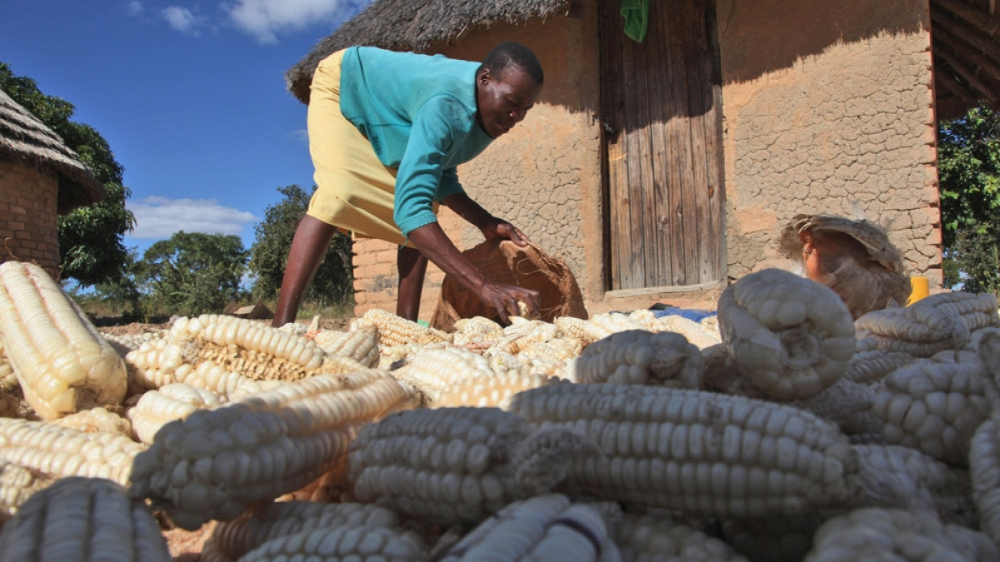
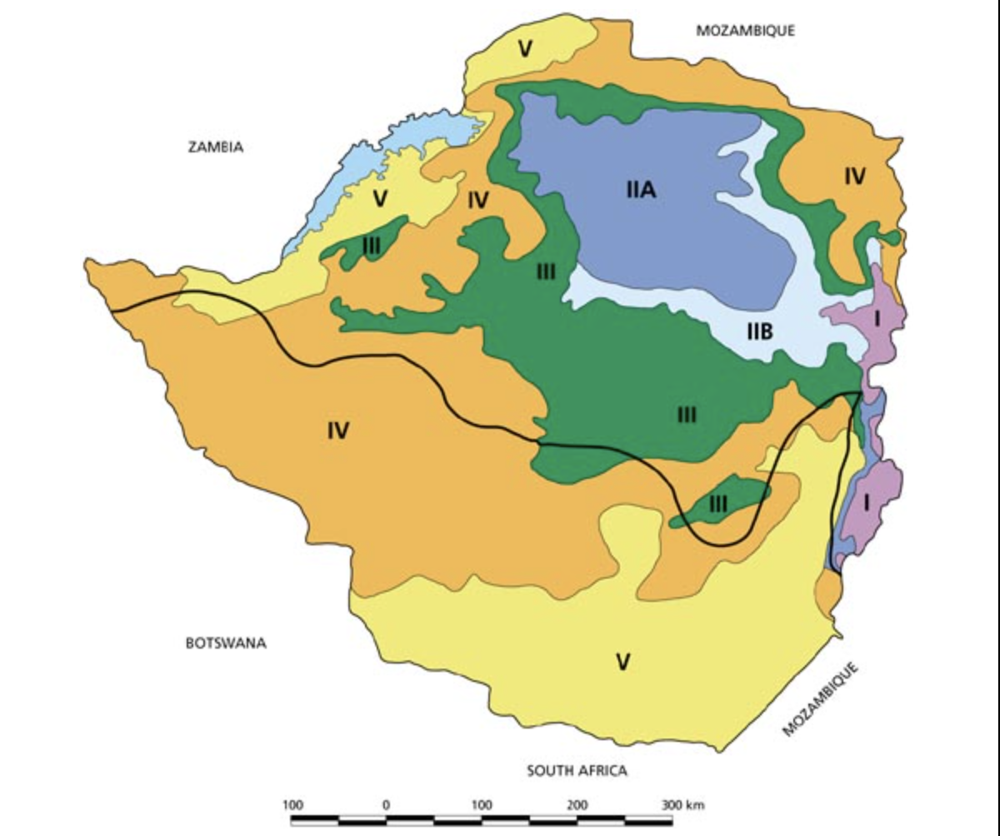
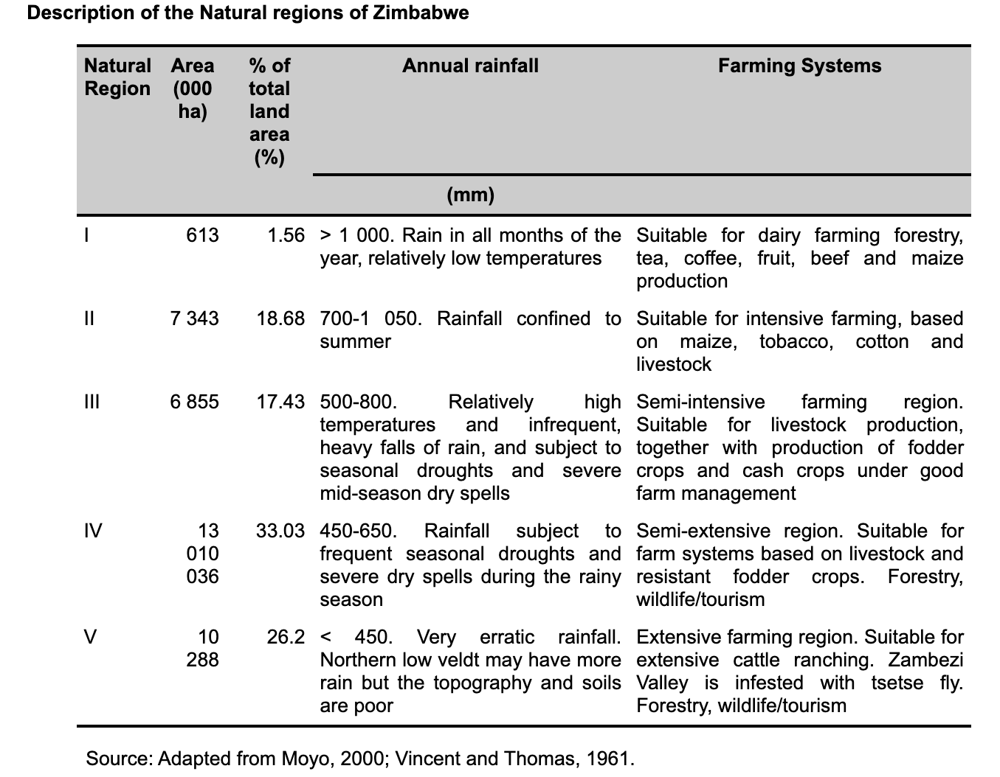
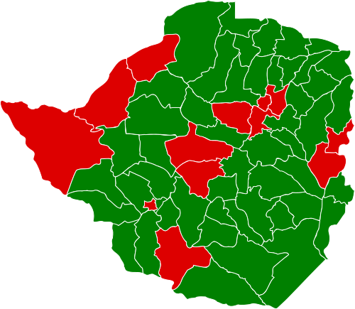
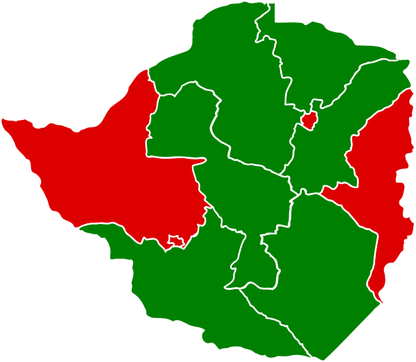

```{r setup, include=FALSE}
# Set code chunk defaults 
# Consider adding `message = FALSE` option
knitr::opts_chunk$set(echo = FALSE, warning = FALSE, message = FALSE) 

#load packages
library(tidyverse)
library(leaflet)
library(sf)
library(kableExtra)
library(RColorBrewer)
library(dplyr)
library(viridis)

#load data
load("final_data/blog_data.RData")
```



# Introduction

## Background and Motivation

The World food programme estimated that more than 7.7 million people in Zimbabwe - half the population - would face food insecurity in 2020. Zimbabwe is not ranked on the Global Hunger Index (because of lack of data) but the 2022 provisional severity is designated as "Serious", a designation carried from as far as 2019. Previously (2017), Zimbabwe has ranked as high as 108 out of 119 countries with the situation exarcebated by economic instability, rising inflation, high unemployment and recurrent erratic climate. This is in stark contrast to 1980, when Zimbabwe was known as the breadbasket of Africa. The situation is most dire in rural areas.

The goal of this study was:

-   to find out how food security & related statistics vary across different regions in Zimbabwe
-   to show the presence (or lack thereof) of the dissonance between rural and urban districts when it comes to poverty rates, food (in)security and food production.

# About the Data

The Poverty Rate, Efficiency and Potential data were obtained from the Food and Agriculture Organisation of the United Nations' (FAO) HiH Agricultural Typologies Datasets.

The shapefiles used to plot the maps were obtained from the Humanitarian Data Exchange, an open data sharing platform managed by the United Nations Office for the Coordination of Humanitarian Affairs.

<!-- The election data table and map were scraped (with permission) from Wikipedia. -->

The population data was scraped (with permission) from ZimStat, the Zimbabwean National Statistics Agency.

The irrigation data was scarped (with permission) from the Zimbabwean Ministry of Agriculture and Land.

# Methodology

To check for scrapping permissions, I used the `robotstxt` and `rvest`packages, then I plucked elements using the `purrr` package. All map plots were made using `leaflet`. The biggest challenge in the wrangling process was in combining the datasets from multiple sources to make the leaflet plots. This was particularly true for the district names since different sources named the districts differently. I used `dplyr` to clean the names and make them uniform across data sources.

# Analysis

### District Potential vs Efficiency

Firstly, I looked at the agricultural potential and efficiency of each district in Zimbabwe.

```{css Michael - cursor edit, echo = FALSE}
/*change the cursor when hovering over the map*/
.leaflet-container {
  cursor: auto !important;
}
```

##  {.tabset}

### Potential

Potential is defined by the Food and Agriculture Organization as "the maximum agricultural income smallholders in a region can attain if performing at maximum capacity (their own, as well as of the markets, productive infrastructure, and basic services surrounding them). Agricultural income potential is determined by both the biophysical factors that impact agricultural production and the economic factors that influence crop prices. Under perfect conditions, it is the interaction of these two sets of elements that establishes the maximum income a farmer can earn from agricultural activities. To increase their agricultural income potential, farmers require long-term R&D investments that completely shift the productive paradigm through technological change."

```{r,echo=FALSE}
distpotential_map <- st_as_sf(distpotential_map)

bins <- c(15, 150, 250, 350, 450, 600,1000,3000, 9000, 16000)
mypal <- colorBin("Greens", 
                domain = distpoverty_map$potential,
                na.color = "transparent",
                bins = bins)

distlabels <- paste(
  "District: ", distpotential_map$district, "<br/>",
  "Province: ", distpotential_map$province, "<br/>",
  "Potential: ", distpotential_map$potential) %>% 
  lapply(htmltools::HTML)

leaflet() %>% 
  addPolygons(data = distpotential_map,
              fillColor = ~mypal(potential),
              stroke = TRUE,
              fillOpacity = 0.5,
              color = 'White',
              weight = 1.5,
              label = distlabels) %>% 
    addLegend(data = distpotential_map,
            "bottomleft",
            pal = mypal,
            values = ~potential,
            title = "Potential",
            opacity = 1)

```

### Efficiency

On the other hand, the Food and Agriculture Organization defines Efficiency as "how much of the potential is attained by farmers in a region under current conditions. To increase their efficiency, farmers need to reduce transaction costs in agricultural production and marketing through improved infrastructure (such as roads) and services (such as market information), overcome market failures (access to credit, insurance, land markets, etc.), and receive better access to basic services (such as education and extension services)."

```{r,echo=FALSE}
distefficiency_map <- st_as_sf(distefficiency_map)

bins <- c(0.001, 0.03, 0.09, 0.11, 0.20, 0.30, 0.40,0.50, 0.60, 0.70,0.80)
mypal <- colorBin("Blues", 
                domain = distefficiency_map$potential,
                na.color = "transparent",
                bins = bins)

distlabels <- paste(
  "District: ", distefficiency_map$district, "<br/>",
  "Province: ", distefficiency_map$province, "<br/>",
  "Efficiency: ", distefficiency_map$efficiency) %>% 
  lapply(htmltools::HTML)

leaflet() %>% 
  addPolygons(data = distefficiency_map,
              fillColor = ~mypal(efficiency),
              stroke = TRUE,
              fillOpacity = 0.5,
              color = 'White',
              weight = 1.5,
              label = distlabels) %>% 
     addLegend(data = distefficiency_map,
            "bottomleft",
            pal = mypal,
            values = ~efficiency,
            title = "Efficiency",
            opacity = 1)

```

### Data Table

```{r}
DT::datatable(pot_eff_df,
              options = list(pageLength  = 10),
              colnames = c("Province",
                           "District",
                           "Efficiency",
                           "Potential"))
```

##  {.unnumbered}

From the Potential plot, we can see that most of the agricultural potential is concentrated in the Northern part of the country, particularly in the provinces of Mashonaland West and Mashonaland Central. It is also important to note that the urban areas, particularly cities, have very low agricultural potential, with towns like Chitungwiza (Harare), Beitbridge Urban (Matebeleland South), and Tsholotsho (Matebeleland North) recording some of the lowest potential.

The agricultural potential translates to agricultural efficiency in some cases, for example the districts of Mount Darwin and Mutoko have relatively high values in both respects. Some districts however have low agricultural potential but high efficiency, a good example being Chiredzi in Masvingo. This could be due to the successful irrigation scheme of the sugarcane lowveld in the district. Other districts like Zvimba and Rushinga have very high potential but are also highly efficient.

These findings paint a picture of the problem faced by Zimbabwean farmers, markets and consumers - the problem where high agricultural potential does not equate high efficiency. This is usually due to unsustainable farming methods, like heavy reliance on rainfall patterns which have become erratic in recent years (shown by the plot below), lack of infrastructural support in the form of farming subsidies and inputs and well developed roads to markets where districts are located far from large cities. This lays a foundation for the food insecurity in Zimbabawe.

## Focus On Provincial Irrigation Capacities

To further investigate the discrepancies between agricultural potential and efficiency, we also plotted the area equipped for irrigation in Zimbabwe to get a picture of farmland that can be relied on to consistently produce food withstanding droughts and seasonal rainfall shifts. Unfortunately, we could not find the district level data from the Ministry of Lands and Agriculture and had to summarise the plot on a provincial level. The Agricultural Regions tab contains a plot of the defined agricultural regions of Zimbabwe and the Regions Table tab explains the characteristics of each region.

##  {.tabset}

### Irrigation

```{r}
irrigation_map <- st_as_sf(irrigation_map) 

bins <- c(0, 100, 5000,10000 ,20000, 30000, 40000,50000,60000)
mypal <- colorBin("GnBu", 
                domain = irrigation_map$area_equipped_for_irrigation_ha,
                na.color = "transparent",
                bins = bins)

distlabels <- paste(
  "Province: ", irrigation_map$province, "<br/>",
  "Area Equipped (ha): ", irrigation_map$area_equipped_for_irrigation_ha) %>% 
  lapply(htmltools::HTML)

leaflet() %>% 
  addPolygons(data = irrigation_map,
              fillColor = ~mypal(area_equipped_for_irrigation_ha),
              stroke = TRUE,
              fillOpacity = 0.5,
              color = 'White',
              weight = 1.5,
              label = distlabels) %>% 
     addLegend(data = irrigation_map,
            "bottomleft",
            pal = mypal,
            values = ~area_equipped_for_irrigation_ha,
            title = "Irrigation area",
            opacity = 1)

```

### Agricultural Regions



### Regions Table



##  {.unnumbered}

Even though we cannot directly tie this plot to potential and efficiency on a district level, we can still see that discrepancies exist between the regions with high potential and those with more land equipped for irrigation. The eastern and southern provinces of Manicaland and Masvingo have significant areas equipped for irrigation despite them having little agricultural potential.

It could be argued that, in the case of Masvingo, which is classified as semi-arid, irrigation is more necessary compared to a province like Mashonaland which traditionally receives more rainfall. This however is not the case for Manicaland which has more irrigation equiped land and receives the most rainfall in the country. Recent years have also shown that traditional rainfall patterns can no longer be relied upon so across the board, there is need for more investment in irrigation equipment to offset the disparity between agricultural potential and efficiency.

## Regional Classification vs Population

We also decided to look at a plot of a combination of these factors. The classification of the regions was obtained from the Food and Agriculture Organization and we decided to pair it with population data from the 2022 census to identify regions where low potential and efficiency might be impacting more people. 

##  {.tabset}

### Classification

The plot below is a combination of the three factors mentioned above having been broken down into seven classification groups.

```{r,echo=FALSE}
combo_map <- st_as_sf(combo_map)

mypal <- colorFactor(viridis(7), 
                domain = combo_map$cat_tercil,
                na.color = "transparent")

distlabels <- paste(
  "District: ",combo_map$district, "<br/>",
  "Province: ", combo_map$province, "<br/>",
  "Potential: ", combo_map$cat_tercil) %>% 
  lapply(htmltools::HTML)

leaflet() %>% 
  addPolygons(data = combo_map,
              fillColor = ~mypal(cat_tercil),
              stroke = TRUE,
              fillOpacity = 0.5,
              color = 'White',
              weight = 1.5,
              label = distlabels) %>% 
     addLegend(data = combo_map,
            "bottomleft",
            pal = mypal,
            values = ~cat_tercil,
            title = "Classification",
            opacity = 1)

```

### Population

```{r, echo=FALSE}
district_pop_map <- st_as_sf(district_pop_map)

bins <- c(0,10000, 50000, 100000,150000, 200000, 250000, 350000,400000, 700000, 1500000)
mypal <- colorBin(#rocket(7),
                "Reds",
                domain = district_pop_map$total_pop,
                na.color = "transparent",
                bins = bins)

distlabels <- paste(
  "District: ", district_pop_map$districts, "<br/>",
  "Province: ", district_pop_map$province, "<br/>",
  "Population: ", district_pop_map$total_pop) %>% 
  lapply(htmltools::HTML)

leaflet() %>% 
  addPolygons(data = district_pop_map,
              fillColor = ~mypal(total_pop),
              stroke = TRUE,
              fillOpacity = 0.5,
              color = 'White',
              weight = 1.5,
              label = distlabels) %>% 
     addLegend(data = district_pop_map,
            "bottomleft",
            pal = mypal,
            values = ~total_pop,
            title = "Population",
            opacity = 1)

```

##  {.unnumbered}

## District & Provincial Poverty Rate

The Food and Agriculture Organization classifies its use of the poverty rate as follows: " The Priority component portrays a region's degree of urgency for investments in development, measured in terms of the wellbeing of the local population and the ultimate target beneficiaries of agricultural innovation efforts. In this analysis, poverty rates have been used as the preferred measure of regional welfare, because of their availability and consistent measurement."

##  {.tabset}

### District

```{r, echo=FALSE}
distpoverty_map <- st_as_sf(distpoverty_map)

mypal <- colorNumeric(
  palette = "YlOrRd",
  domain = distpoverty_map$poverty_rate,
  na.color = "transparent")

distlabels <- paste(
  "District: ", distpoverty_map$district, "<br/>",
  "Province: ", distpoverty_map$province, "<br/>",
  "Poverty Rate: ", distpoverty_map$poverty_rate) %>% 
  lapply(htmltools::HTML)

leaflet() %>% 
  addPolygons(data = distpoverty_map,
              fillColor = ~mypal(poverty_rate),
              stroke = TRUE,
              fillOpacity = 0.5,
              color = 'White',
              weight = 1.5,
              label = distlabels) %>% 
  addLegend(data = distpoverty_map,
            "bottomleft",
            pal = mypal,
            values = ~poverty_rate,
            title = "Poverty Rate",
            opacity = 1)
```

<!-- ### Election results -->

<!--  -->

### Provincial Poverty Rate

```{r, echo=FALSE}
prov_pov_map <- st_as_sf(prov_pov_map)

bins <- c(0, 20, 150, 250, 600,700,800)
mypal <- colorBin(#rocket(7),
                "Purples",
                domain = prov_pov_map$poverty_rate,
                na.color = "transparent",
                bins = bins)

distlabels <- paste(
  "Province: ", prov_pov_map$province, "<br/>",
  "Poverty Rate: ", prov_pov_map$poverty_rate) %>% 
  lapply(htmltools::HTML)

leaflet() %>% 
  addPolygons(data = prov_pov_map,
              fillColor = ~mypal(poverty_rate),
              stroke = TRUE,
              fillOpacity = 0.5,
              color = 'White',
              weight = 1.5,
              label = distlabels) %>% 
     addLegend(data = prov_pov_map,
            "bottomleft",
            pal = mypal,
            values = ~poverty_rate,
            title = "Poverty Rate",
            opacity = 1)

```

<!--  -->

##  {.unnumbered}

# Limitations

# Future work
